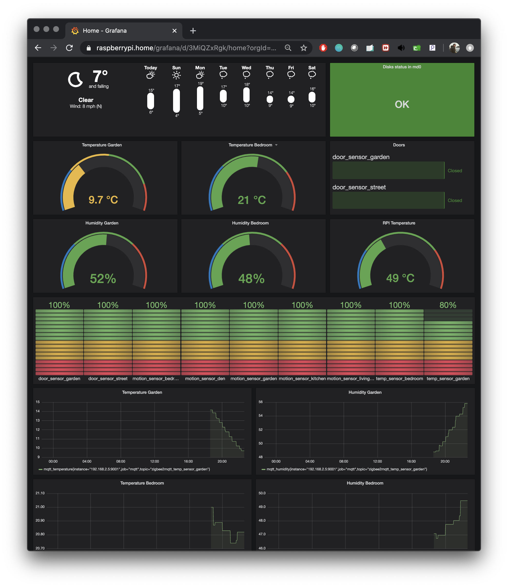

#                     Deploying Home

- [x]  ssh Telegram norification
- [x]  openvpn Telegram notification
- [x]  mdadm events telegram alerts code in ansible
- [x]  raspberry temperature monitoring with dashboard
- [ ]  smart plug with metrics
- [x]  move to gitlab
- [x]  CA for home web UIs
- [x]  mtpoxy ansible
- [x]  mosquitto
- [x]  flash CC2531 for zigbee2mqtt
- [x]  set up zigbee sensors
- [x]  CC2531 zigbee2mqtt setup
- [x]  3D model for CC2531 OnShape or TinkerCAD
- [ ]  alertmanager with telegram bot
- [ ]  move home assistant secrets to secrets.yml
- [x]  move ansible secrets to vault
- [ ]  mosquitto-exporter arm image
- [x]  MQTTGateway for Prometheus
- [ ]  openvpn with all certs in ansible
- [x]  try https://pi-hole.net/
- [ ]  put dns bindings into ansible
- [ ]  improve lovelace dashboard
- [x]  open door notifications

